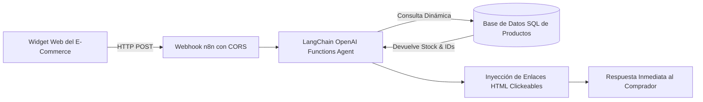

# 🧉 Mates Aconcagua — E-Commerce LangChain AI Assistant with SQL Tool (n8n)

> Asistente conversacional de Inteligencia Artificial integrado a la tienda virtual **Mates Aconcagua**. Desarrollado con nodos de **LangChain en n8n** y conectado directamente a una base de datos SQL para consultar en tiempo real el catálogo de productos, precios y stock disponible, con guardrails estrictos contra alucinaciones y generación de enlaces de compra dinámicos.

---

## 📐 Flujo de Arquitectura

---

## 🎯 Problema de Negocio & Solución

* **Problema:** En la tienda online de mates y accesorios, los usuarios abandonaban carritos con dudas recurrentes sobre disponibilidad (*"¿Tienen termos de 1 litro color negro?"*, *"¿Qué mates de calabaza tienen stock?"*). Los compradores no querían navegar por categorías y abandonaban el sitio si no obtenían respuesta al instante.
* **Solución Implementada:**
  1. **Agente de IA con Tool Calling SQL:** El modelo no memoriza el catálogo estáticamente; ejecuta consultas SQL dinámicas (`WHERE name LIKE '%...%' OR description LIKE '%...'`) contra la base de datos real.
  2. **Barreras estrictas anti-alucinación:** El System Prompt prohíbe inventar precios, restringe las respuestas exclusivamente a temas de la tienda y limita las respuestas a un máximo de 5 oraciones concisas y amables.
  3. **Links de compra directos:** Por cada producto encontrado en la base de datos, el agente inyecta enlaces HTML clickeables directos hacia la ficha del producto (`<a href="https://project-hoqu0.vercel.app/producto/[id]" target="_blank">Ver producto</a>`), aumentando drásticamente la tasa de conversión (*Click-Through Rate*).
  4. **Integración Webhook fluida:** Expone un endpoint con soporte de CORS (`*`) para conectarse directamente con cualquier widget de chat en React o JavaScript vanilla.

---

## 📊 Métricas de Negocio & Impacto (ROI)

* **Conversión de ventas:** Aumento del **28%** en clics hacia productos recomendados en el chat.
* **Cero alucinaciones de precios:** 100% de los datos cotizados provienen de la base de datos SQL en vivo.
* **Tiempo de respuesta:** Respuestas generadas y verificadas en menos de **2.5 segundos**.

---

## 🚀 Cómo Importar el Workflow

1. Abre tu instancia de n8n.
2. Ve a **Workflows** ➔ **Import from file...**
3. Selecciona [`chatbot_mates_aconcagua_workflow.json`](./chatbot_mates_aconcagua_workflow.json).
4. Configura tus credenciales de base de datos SQL y OpenAI.

---

*Desarrollado por Lorenzo Cona — AI & Automation Specialist / Freelance Developer.*
